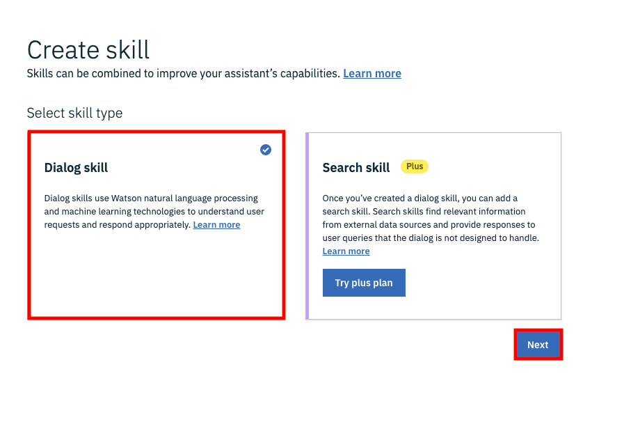
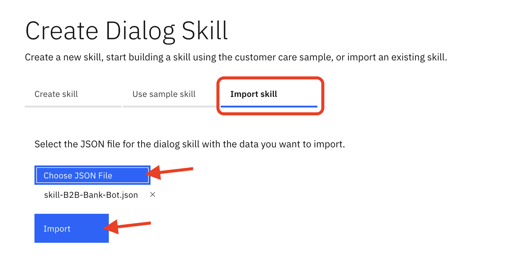
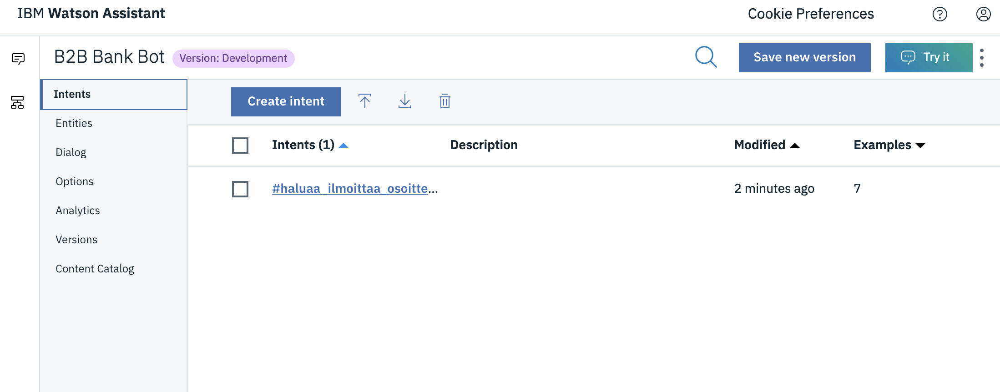
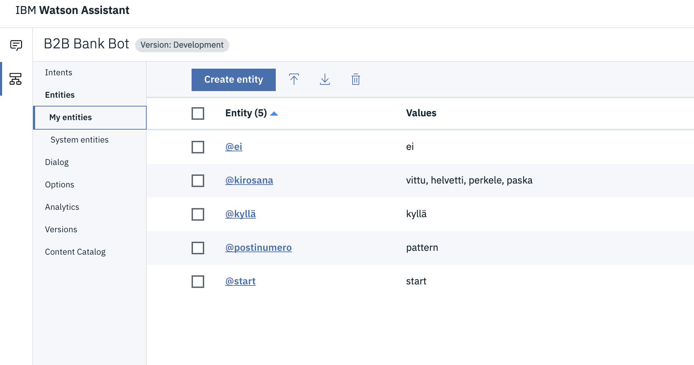
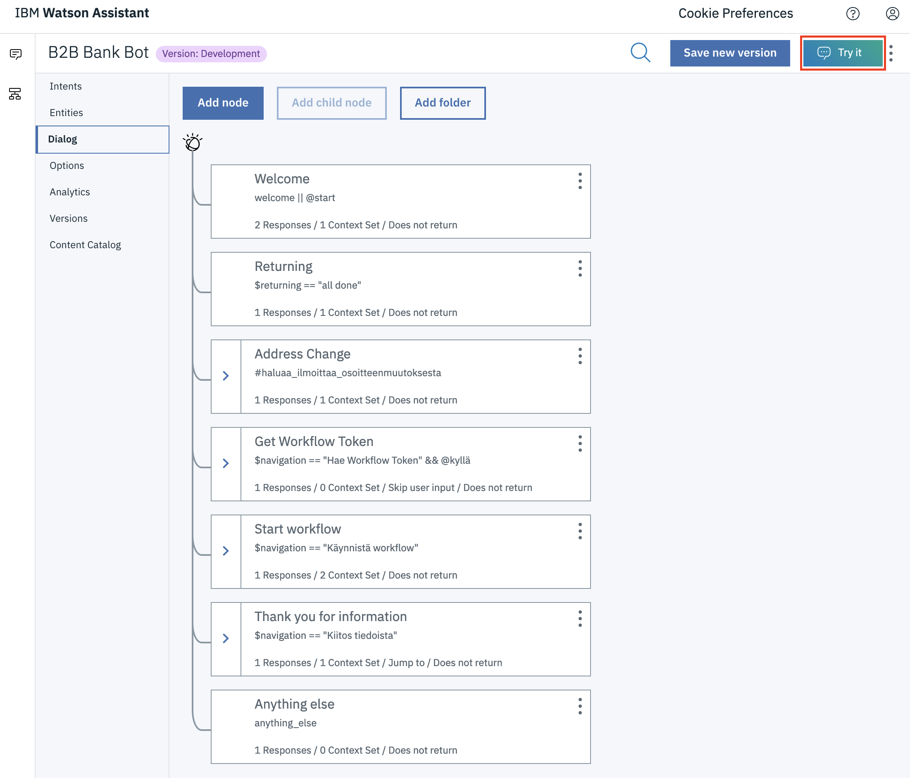
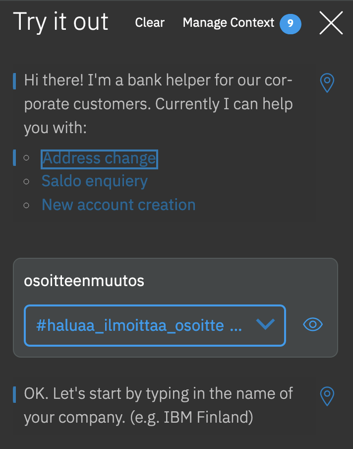
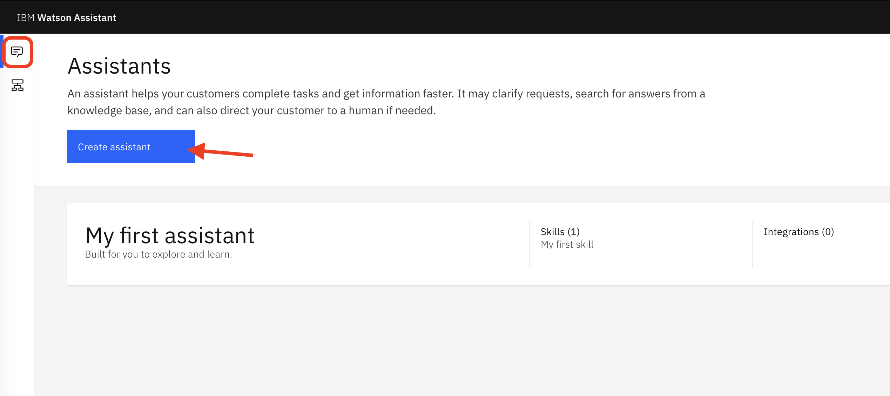
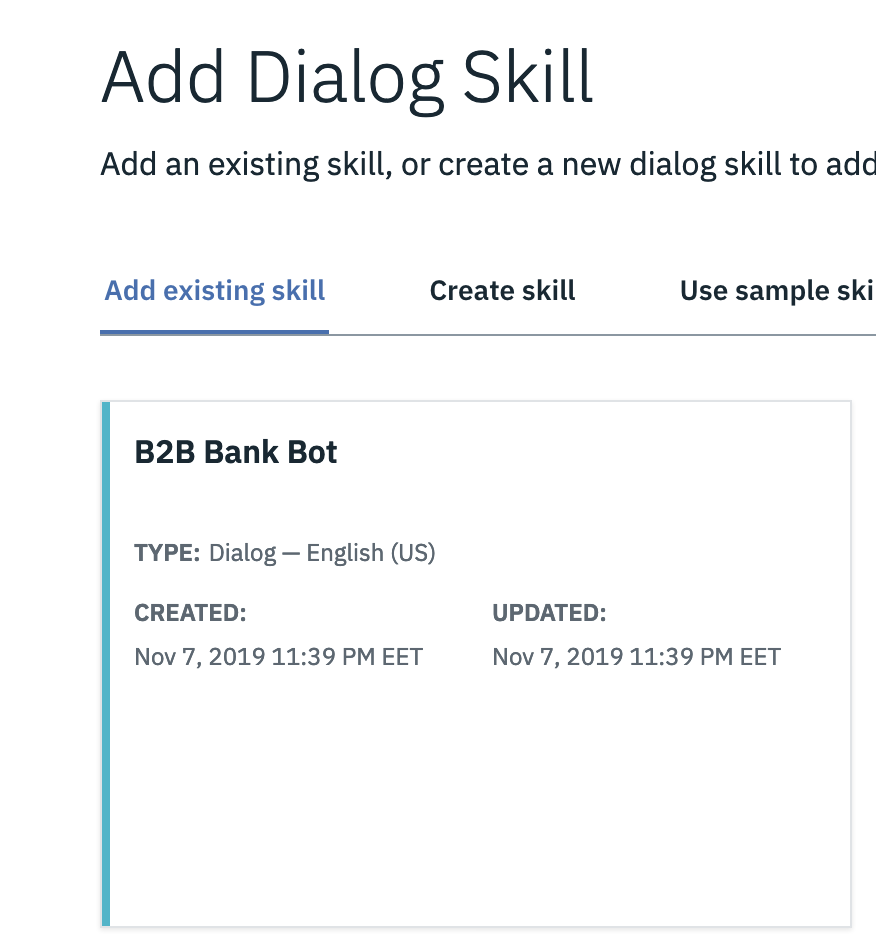
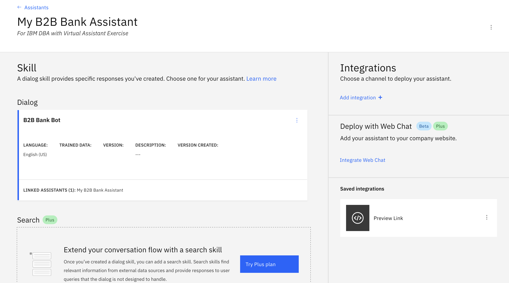
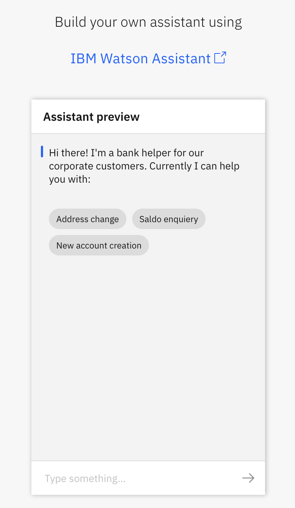

# _**Watson Assistant Lab 1**_: Cognitive Chatbot Basics
In this lab we'll start to build a chatbot using _**Watson Assistant**_. This basic chatbot is a banking bot that will help the user with things like making a credit card payment or choosing a credit card. 

## Requirements
- [IBM Cloud account](https://cloud.ibm.com/)

## Agenda
- Introduction to [Watson Assistant](https://www.ibm.com/cloud/watson-assistant/)
- Setup the **_Watson Assistant_** service
- Import basic Watson Assistant skill
- Test your chatbot
- Build a web based chat interface for your chatbot (Optional)

## Introduction to Watson Assistant
IBM **_Watson Assistant_** allows you to create cognitive chatbots that you can customise for your business, and deploy them across multiple channels to bring help to your customers where and when they need it.

Most chatbots try to mimic human interactions, which can frustrate users when a misunderstanding arises. Watson Assistant is more. It knows when to search for an answer from a knowledge base, when to ask for clarity, and when to direct you to a human.

Anyone can build chatbots with **_Watson Assistant_** - it comes pre-trained with industry-relevant content, can make sense of your historical chat or call logs, and has a visual dialog editor. Industry-leading AI powers the underlying natural language models that understand your users and provides training recommendations as you build and run your chatbot. And you have the flexibility to deploy **_Watson Assistant_** within your own site, in a mobile app, and via many messaging channels and customer service tools.

## Setup the Watson Assistant service
In this section we are going to create a **_Watson Assistant_** instance on IBM Cloud, and use it to build a basic chatbot that answers queries about mobile phones.

**(1)** Log into IBM Cloud and create a **_Watson Assistant_** service.
- Click on `Catalog`, then filter by clicking on `AI`
- Select `Watson Assistant`

  

**(2)** Create the service with a unique name: we'd suggest something like `Watson Assistant-eventname-yourinitials`.

Scroll down and ensure you are using the `Lite` plan, then hit `Create`.

**(3)** Click on `Launch Watson Assistant`.

## Understanding user intent: create _**intents**_ and _**entities**_
**(1)** The first thing we need to do in **_Watson Assistant_** is create a _**Skill**_. A _**skill**_ contains the training data and machine learning logic that enables your chatbot to understand and help users and customers.

Due to time contrains in this session we will import an existing skill. This is basic IT support chatbot conversation, where we will add in the next part the integration to Business Automation Workflow.  

Download the skill from this link: https://ibm.box.com/v/B2B-Bank-Bot

There's an `Import Skill` option available whenever you create a new skill - it will be useful when you are backing up, exchanging skills, etc. Find the downloaded .json file in your computer and choose to import Everything.

You will be directed to the chatbot content.

**(2)** Explore the chatbot content.

An _**intent**_ represents the purpose of a user's input. By recognising the intent expressed by a user, Watson Assistant can choose the correct dialog flow to use to respond to it. To plan the intents for your application, you need to consider what your chatbot users might want to do, and what you want your application to be able to handle.

For this assistant we have currently implemented just one intent: #haluaa_ilmoittaa_osoitteenmuutoksesta (for understanding that the customer wants to notify us of address change).

An _**entity**_ represents a term or object in the user's input that provides **context** for a particular _intent_. If _intents_ represent _verbs_ (something a user wants to do), _entities_ represent _nouns_ (such as the object of, or the context for, an action).

_**Watson Assistant**_ can also recommend _**synonyms**_ for your _**entity**_ values. The recommender finds related _synonyms_ based on contextual similarity extracted from a vast body of existing information, and uses natural language processing techniques to identify words similar to the existing _synonyms_ in your _entity_ value.

You can also use _**pattern matching**_ when creating _entity_ values. This is really helpful if you want to pick up _entities_ that have specific formats, e.g. phone numbers or website addresses.

A _**dialog**_ uses the _intents_ and _entities_ that are identified in the user's input, plus _context_ from the application that uses _**Watson Assistant**_, to interact with the user and ultimately provide a useful response. Our _dialog_ tree should help the user choose a new mobile phone based on an existing preference or a characteristic important to the user.

## Test your chatbot
**(1)** You can test your _dialog_ inside the _**Watson Assistant**_ application. Select the `Try It` button at the top right of the screen to enter the _dialog_ tester.

**(2)** Try and test all of your _dialog_ branches. It'll look something like this:

See how _**Watson Assistant**_ is picking out the _intents_ and _entities_ it sees in the user input, and responds accordingly.

You will be able to test the integration with the Business Automation Workflow once you get through the next 3 labs using the _**Address Change**_ option. :smile:

## Build a web based chat interface - OPTIONAL

**We recomend you leave this part for the end and move on to lab 2 in order to finish the labs for the workshop.**

Build a web-hosted chat widget that will allow you to test the _**Watson Assistant**_ _skill_ you've just created in a web environment.

An _**assistant**_ is the user-facing component of _**Watson Assistant**_ that manages the flow of information between your _skills_ and your users. _Assistants_ also allow you to create _**integrations**_ that publish your chatbot to the channels your customers will typically go to for help, e.g. _Slack_, _Facebook Messenger_, _Wordpress_.

**(1)** Select `Assistants` from the menu bar and `Create new`.

**(2)** Add a **Name** and **Description** for your _Assistant_, and select `Create assistant`.

**(3)** From here Select `Add Dialog Skill` and select your `B2B Bank Bot` skill.

**(4)** Your _Assistant_ should now look like this:

## Create a _**Preview Link**_: a web widget to test your chatbot
The first _integration_ we'll create for our chatbot is a _**Preview Link**_. Actually, when you create an _assistant_, a test web site is provisioned for you _automatically_. It has a simple chat widget interface that you can use to interact with your chatbot for testing purposes. You can also share the URL to this IBM-branded site with your team members.

**(1)** Select the `Preview Link` that has already been created from `Integrations`:

**(2)** You can change the **Name** and **Description** of the _Preview Link_ if you like. For now though, just click the URL under **Try it out and share the link**.

**(3)** You'll then be taken to a web page where your chatbot is hosted within a widget:

That's it! You have a shareable web-based chatbot you can use to externally test your _skill_. 

## Summary
Well done! You've created your first basic chatbot that understands user _intent_, can pick out _entities_, and responds differently depending on user input. 

