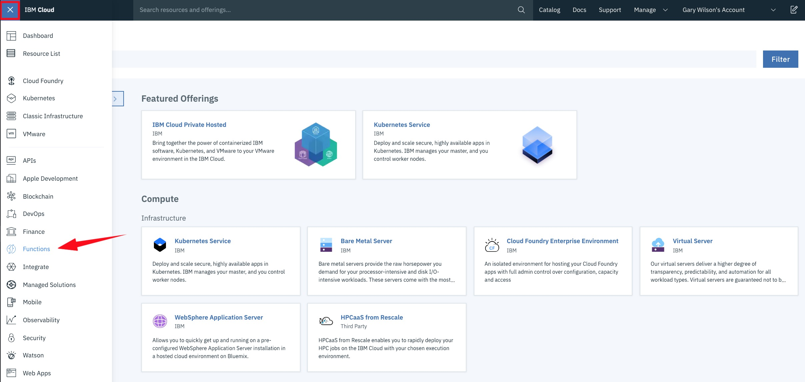
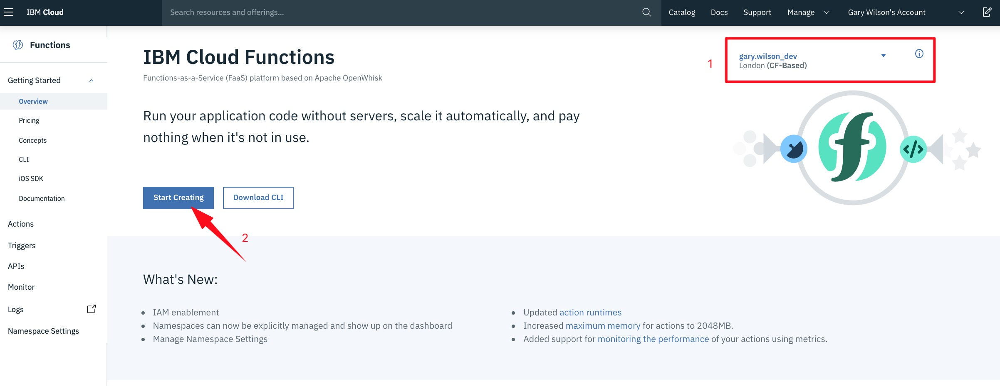
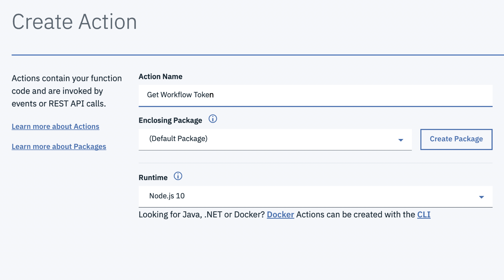
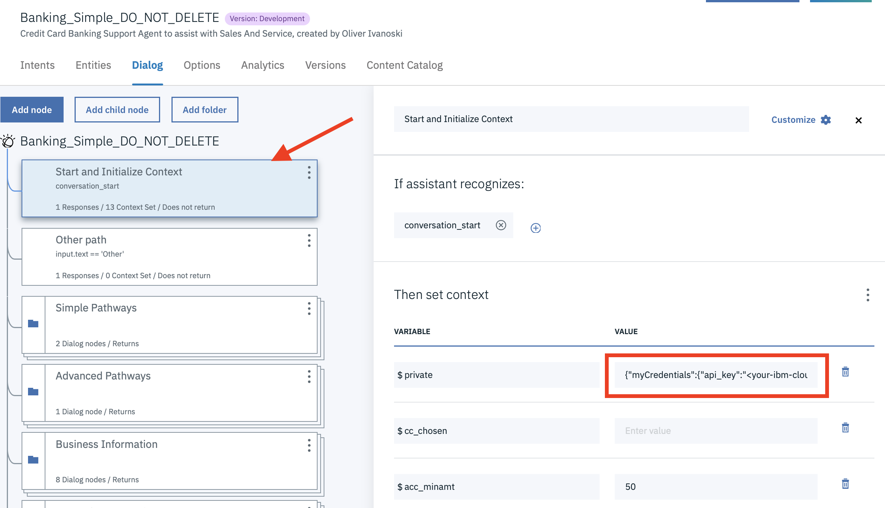
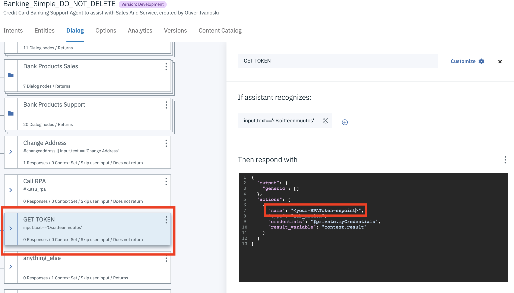
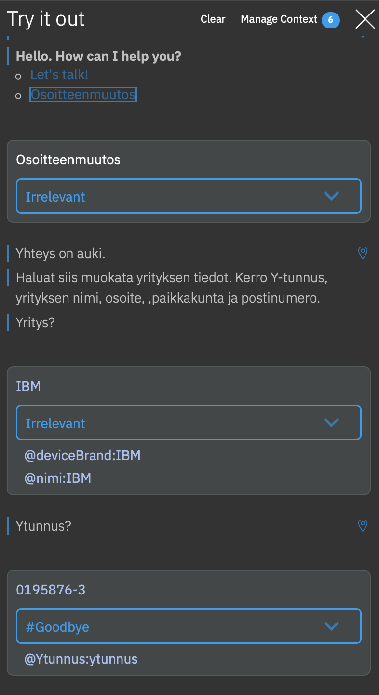
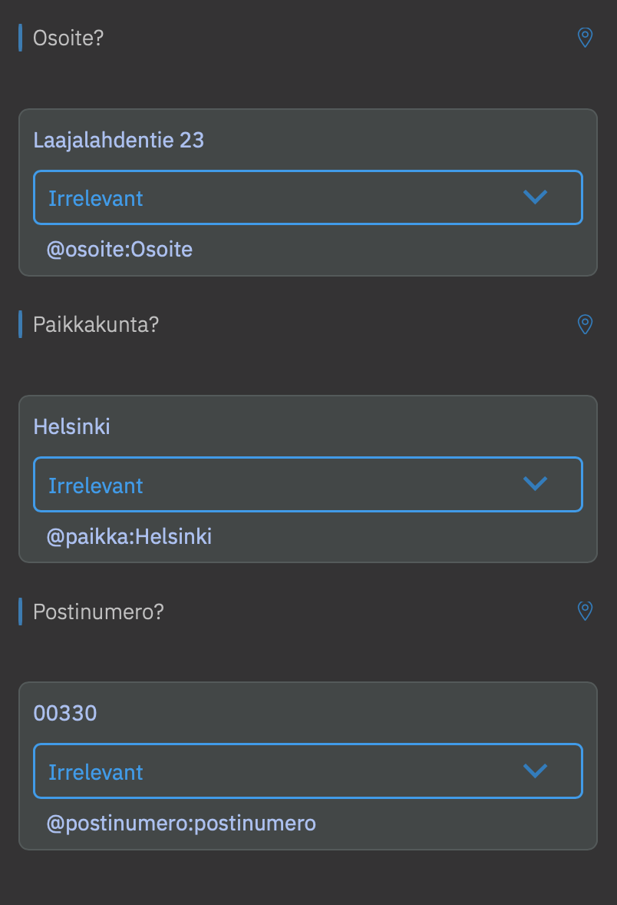
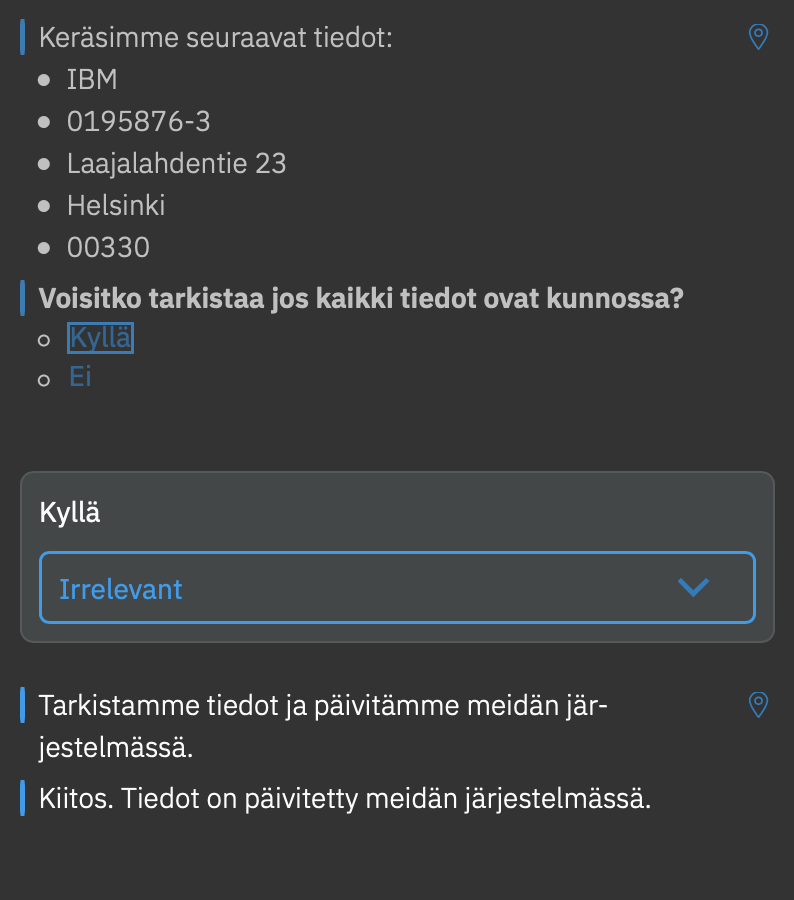

# _**Watson Assistant Lab 2**_: Integrating Business Automation Workflow (BAW) with Watson Assistant
In this lab we're going to show how you can extend your chatbot with a IBM Business Automation Workflow environment and Robotic Process Automation using _**IBM Cloud Functions**_.

In practical terms, we'll build another _**Watson Assistant**_ _intent_, that allows the user to submit a new address information. When we pick up this _intent_, we'll ask the user for the new address, feed the input text through the BAW and then RPA (Robotic Process Automation) and return a response based on the success of the address change. 

## Requirements
- IBM Cloud account 
- Previous lab

## Agenda
- Setup _**IBM Cloud Function**_
- Setup _**Watson Assistant**_ to use _**IBM Cloud Functions**_ 


## Setup _**IBM Cloud Function**_
**(1)** We need a mechanism by which we can call the  workflow (running on IBM Business Automation Workflow environment) service, so we can passing our user's input text to the API. We'll do this by creating an _**IBM Cloud Function**_.

With _**IBM Cloud Functions**_ you can write lightweight code that executes application logic in a scalable way. You can then run this code on-demand via requests from applications like our _**Watson Assistant**_ chatbot, or automatically in response to events.

Some examples of how we might use an _**IBM Cloud Function**_ from within _**Watson Assistant**_ include:

- Validating information that you collect from the user.
- Doing calculations or string manipulations on user input that are too complex for supported _SpEL_ expression methods to handle.
- Interacting with an external web service to get information. For example, you might check on the expected arrival time for a flight from an air traffic service.
- Sending requests to an external application, such as a restaurant reservation site, to complete a simple transaction on the user's behalf.

**(2)** Go to _**IBM Cloud Functions**_ by selecting the `burger icon` in the top left-hand corner, then `Functions`.



From there, first _**check the pulldown menu at the top right**_.

Make sure the selected location is the same region where you created your Watson Assistant service. 

Next, click `Start Creating`, then `Create Action`.




**(3)** Call your new action `Get Workflow Token` then ensure you select a `Runtime` of **Node.js**, and hit `Create`.



You'll then be transported to a code editor. Delete all of the default lines of code within the editor, and replace them with these:

```Javascript
/**
  *
  * main() will be run when you invoke this action
  *
  * @param Cloud Functions actions accept a single parameter, which must be a JSON object.
  *
  * @return The output of this action, which must be a JSON object.
  * 
  * The port is unique to every environment 
  *
  */

const needle = require('needle');

async function main(params) {
    
var headers = {
    'Content-Type': 'application/json',
    'Host': 'api.eu-gb.apiconnect.appdomain.cloud'
};

var data = '{"refresh_groups": true,"requested_lifetime": 7200}';

var options = {
    method: 'POST',
    headers: headers,
    body: data
};

// Make sure you replace XXXX with your port number
var URL = 'https://api.eu-gb.apiconnect.appdomain.cloud/jkj-org-dev/sb/awib-workflow/login?port=XXXXX';

  try {
    
    let response = await needle(URL,headers,options);
    var token = response.body.csrf_token;
    var call_result = {
        "token": token,
        "status": "Success"
    }
    return {token: token, status: "Success"};

  } catch (err) {
    console.log(err)
    return Promise.reject({
      statusCode: 500,
      headers: { 'Content-Type': 'application/json' },
      body: { message: err.message, status: "Failed" },
    });
    console.log("error test");
  }
}
exports.main = main; 
```

This code will call the managed workflow (running on IBM Business Automation Workflow environment) API and get the authentication token. 

**(4)** You only need to make a small change to this code.

- Replace `port=XXXX` with the value of your environment port.

Now hit `Save`.


Select `Endpoints` from the sidebar, tick the `Enable as Web Action` box, then `Save`.


Copy the Web Action URL and save it in a notepad, you will need it later. It should look like this:

https://us-south.functions.cloud.ibm.com/api/v1/web/sandra.calvo%40fi.ibm.com_dev/default/Token.json

**(5)** Now let's create another action. Click on the Actions menu on the top left side of the screen:


Then repeat the previous process. Create new action called: **WorkflowCall** and paste the following code:

```Javascript
/**
  *
  * main() will be run when you invoke this action
  *
  * @param Cloud Functions actions accept a single parameter, which must be a JSON object.
  *
  * @return The output of this action, which must be a JSON object.
  *
  */

const needle = require('needle');

async function main(params) {
    
var headers = {
    'Content-Type': 'application/json',
    'BPMCSRFToken': params.token,
    'Host': 'api.eu-gb.apiconnect.appdomain.cloud'
};


var payload = {
    input:[
      {
        name: 'data',
        data: {
          name: params.nimi,
          business_id: params.Ytunnus,
          street_address: params.osoite,
          postcode: params.postinumero,
          city: params.paikka,
        }
      },
    ]
  };

var options = {
    method: 'POST',
    headers: headers,
};

//Replace the XXXX with your port number
var URL = 'https://api.eu-gb.apiconnect.appdomain.cloud/jkj-org-dev/sb/awib-workflow/process?model=Handle%20data%20change&container=AWIBWOR&port=XXXXX';

  try {
   let response = await needle(URL,JSON.stringify(payload),options);
    var success = response.body;
    console.log(response.body);
    return {success};

  } catch (err) {
    console.log(err)
    return Promise.reject({
      statusCode: 500,
      headers: { 'Content-Type': 'application/json' },
      body: { message: err.message },
    });
    console.log("error test");
  }
}
exports.main = main;

```

This code will use the authentication token from the previous action and call the BAW with the data we enter in the Watson Assistant chatbot. 

**(6)** You only need to make a small change to this code.

- Replace `port=XXXX` with the value of your environment port.

Now hit `Save`.

Select `Endpoints` from the sidebar, tick the `Enable as Web Action` box, then `Save`.


Copy the Web Action URL and save it in a notepad, you will need it later. It should look like this:

https://us-south.functions.cloud.ibm.com/api/v1/web/sandra.calvo%40fi.ibm.com_dev/default/WorksflowCall.json


**(7)** We've now successfully created two _**IBM Cloud Function**_ that can accept text as input and talk to the BAW API that will later launch the RPA process. The final thing we need to do here is to make this function callable from within _**Watson Assistant**_ (or in fact, any other application).

Now let's go and use our functions in _**Watson Assistant**_.

## Setup _**Watson Assistant**_ to use _**IBM Cloud Functions**_
As you've already seen, you need to pass security credentials between services and applications in order to use them. In order to call _**IBM Cloud Functions**_ from within _**Watson Assistant**_ _dialogs_ we need to understand their credentials and encode them correctly.

**(1)** Get your _**IBM Cloud Function**_ **API Key** from the `Namespace Settings` option in the left side meny. There's a copy icon available to copy the key to the clipboard.


**(2)** In your _**Watson Assistant**_ _skill_, you will see a node called `Conversation Start`. 
Under the 'set context' there is a variable called `$private` with the value below:
```Javascript
{"myCredentials":{"api_key":"<your-ibm-cloud-functions-api-key>"}}

```

Replace `<your-ibm-cloud-functions-api-key>` with the key you copied earlier in step **(1)**.



Now regardless of integration type our chatbot will always start correctly, and it will define the credentials required to call any of our _**IBM Cloud Functions**_.


**(3)** Even though the main conversation is in English we created this path in Finnish to prove Watson Assistant language capabilities. 

Find the node called _**Get Token**_ and click on it.

The **only** thing you will need to replace here is `<my-Token-endpoint>`. If you didn't save the endpoint in you can get the name of your _**endpoint**_ by going back to your _**IBM Cloud Function**_ in IBM Cloud, clicking `Endpoints` from the sidebar (if you're not already on that screen), then copying everything in the **Web Action URL** _after_ _**.../web/**_.

It should look something like:
```Javascript
name.lastname_dev/default/Token.json
```




**(4)** Find the node called _**Call RPA**_ and modify your enpoint. Remember this connection calls the managed workflow that will later start the RPA process. It should look like:

```Javascript
name.lastname_dev/default/WorkflowCall.json
```


Fantastic! Continue with lab 3 to get started with the Robotic Process Automation part. Once you have the next labs running you will be able to call it from your chatbot. 


## Summary
You've reached the end of this lab! By completing it you've learned how to further enhance your chatbot by calling additional services using _**IBM Cloud Functions**_. 


Once you have completed the next two labs you will be able to connect with the BAW using your chatbot. 
The chatbot will gather the information needed (Company name, company number, address, city, postnumber) and send them to the BAW to be checked. 

This is what the conversation will look like:






