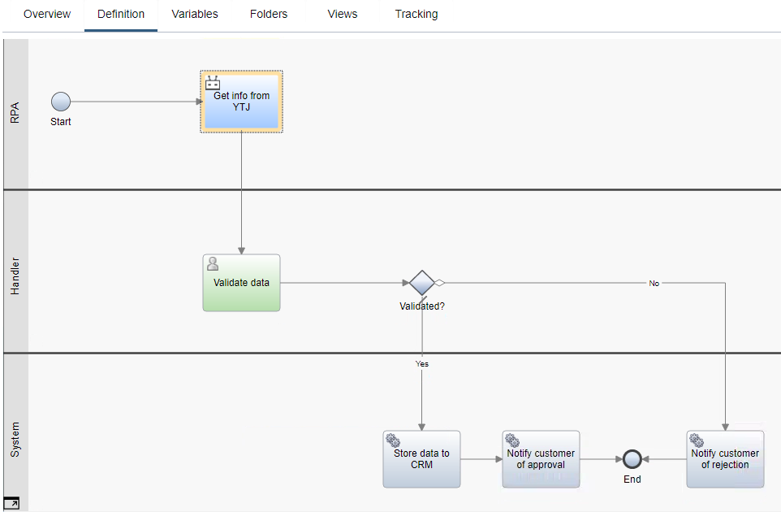
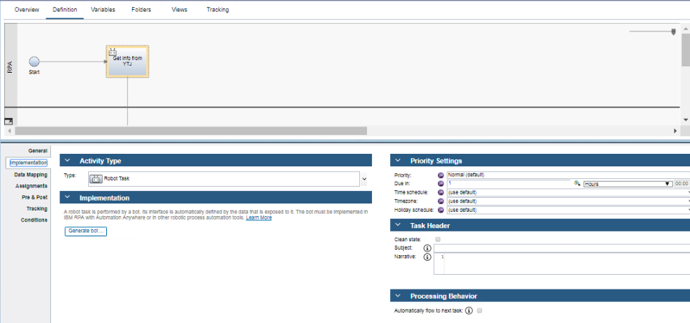

# **Lab 3: IBM Business Automation Workflow**
Here we will explore Business Automation Workflow (BAW) and view a few of its core functions. As BAW offers a wide variety of functions, we will focus only on the main elements used on this workshop. Every component used in this workshop is already done however it is important to understand on a high level what is happening. 

### Content
- [Access to BAW](#access-baw)
- [Finding the workflow](#finding-the-workflow)
- [Quick guide on workflows](#quick-guide-on-workflows)
- [Editing workflows](#editing-workflows)  

### Access BAW
Use the instructions given by your instructors to access your virtual environment and open it in your browser.

Within the virtual desktop, open Chrome and navigate to **BAW** Login (Bookmark folder BAW -> Workflow Center - Solutions). Fill in the ``username`` (admin) & ``password`` (admin).

### Finding the workflow  

After we have logged into Workflow Center, we want to select ``Process Apps``. From Process Apps, select and open the Process Application created for this workshop -> ``AWiB-workflow`` (click the blue "AW circle" within its tile).

When the Process Application opens in web process designer, click ``Processes`` from the left-hand side navigation bar and then from the opened menu ``Handle data change``. This will open our workflow model - the one that our Watson Assistant triggers - in designer.

### Quick guide on workflows
This workflow has 3 lanes, **RPA**, **Handler** and **System** (these lanes are user defined so you can name them whatever you like).

  

In this particular workflow:  
- **RPA** Is responsible of the robot actions. It takes values from the ``start`` node (values we sended from Watson assistant) and performs our ``Robot task`` that you will create in next lab.
- **Handler** lane has an ``Validate data`` node. 
We have defined it to be a so called human task where we have created a simple UI. This UI will show the information we got from the ``start`` node and the information from the ``Robot task`` node, so that our handler who performs this task can compare the information. The user has to review the information and decide if the information is valid.
- **System** lane has a few nodes in this setup. These nodes are completely demostrative for this workshop, but we have given a few examles you could do after the user has validated the data. If the data is valid, we could save the updated data to an CRM alternatively we could inform the customer that we couldn't update the information.

### Editing workflows
By clicking a node - also called as an ``activity`` or a ``step`` of a workflow) in the workflow, you are able to view and edit its configuration.

   

Settings we would normally need to set on the ``Robot task`` **NOTE!**: everything in the workflow and within its activities is already configured, so don't change anything.
- **General** Give name and if you want, also color for the activity. 
- **Implementation** Here you choose the type of the activity, and if it is an ``Robot task``you would need to press **Generate bot...** to create a bot definition file that you can later on use to implement the actual RPA bot. You do not need to do it now.
- **Data Mapping** If the robot uses additional information we need to provide them to it. Here we map the data to parameters so that the bot is able to use it.

When you open an ``UI node / Human task activity`` (Validate data), the so called ``coach designer`` opens. Here you can implement your human taks in form of UIs (pages with whatever content) and logical screen flow between them.
1. Clik the ``User Task activity`` (Validate data) to select it.
2. From the ``Implementation``tab (at the properties section bottom part of the screen) open the implementation file (Validate data CSHS) by clicking it.
3. Open the ``Diagram`` tab (if not opened automatically) to observe the screenflow we have built. You can test the UI from the top-right corner by pressing the run icon.
4. You now see what the user form looks like.

  

We have defined that it the flow will continue depending on what button (Approve or Decline) the user has pressed. Based on that decision, we will either run `Success`or `Decline` Script Task to set the variable *data_validated*.

### Summary
Well done! You've now explored a few of the basic elements of IBM Business Automation Workflow. Feel free to explore the diffrent nodes/activities and options on this workflow. Just do not change anything that has already been configured for your convenience :)
