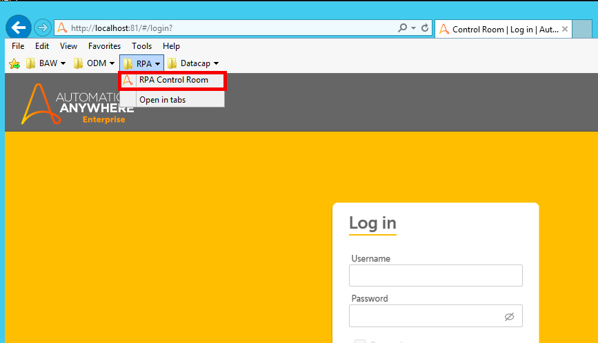
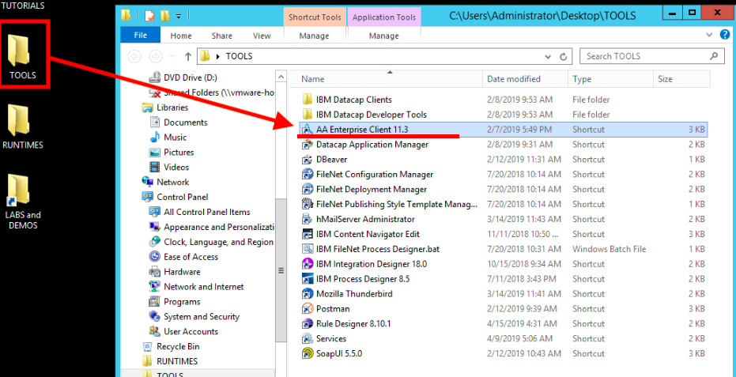
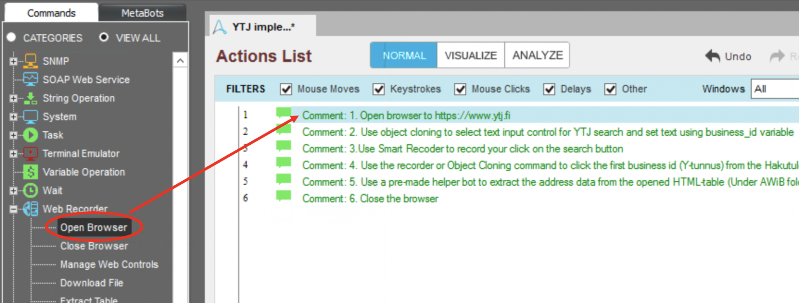
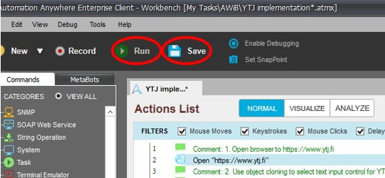
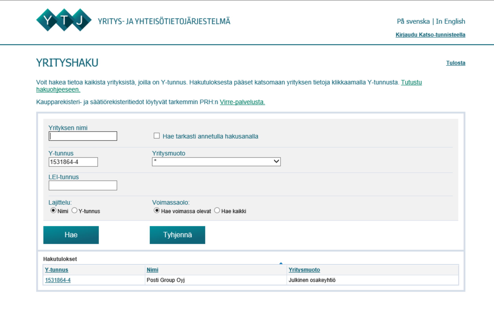
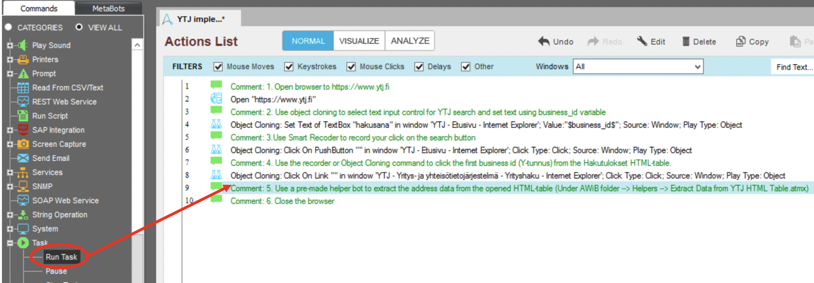

## Welcome to the RPA workshop
If the other sections where mainly reading and viewing already done elements, now you will get to create your own working bot with _Robotic Process Automation_ platform (IBM RPA with Automation Anywhere).  

What this ``bot`` should do:
1. Wait for a task assigment (Get info from YTJ) from the workflow (Handle data change) that is triggered from our _Cloud Functions_ within our Watson Assistant chatbot.
2. Receive the business_id (y-tunnus) from the workflow.
3. Navigate to _ytj.fi_ web site and creates a search with the given business_id.
4. Gather the address information from the search result.
5. Send the gathered information back to our workflow that automatically forwards it to the next task in the workflow (User validation).

#### Content
- [Setup](#setup)
- [Launch RPA](#launch-rpa)
- [RPA implementation artifacts](#rpa-implementation-artifacts)
- [Editing the bot](#editing-the-bot) 
- [Implementing the bot](#implementing-the-bot) 
- [Help](#help)

### Setup
**Check** that the RPA is running by opening __Chrome__ web browser and opening ``RPA Control room`` from the bookmarks under RPA-folder. You should see this page (No need to login, just check that the page loads). If not, ask your instructor to help you.

  

### Launch RPA
Open the __TOOLS__ folder from your desktop and double click __AA Enterprice Client 11.3__ to open our RPA editor.

After that login  with ``username`` (__developer__) & ``password`` (__adminadmin__).

   

It might prompt you with a pop-up - if so, select __Skip__ from the bottom-right. 

### RPA implementation artifacts
We have already created a skeleton implementation for you to get started. Move to __AWiB__ folder by clicking the folder from the Task navigation area on the left-hand side under My Tasks. The contents of the AWiB folder will be shown within the editor.

**!!** **If you double-click a file it will run it.**  **!!** So, DO NOT run these unless told in these instructions.

``You can edit the file by clicking it once and select edit from the top or right-click and select edit.`` Or right-click the file and select "Edit" from the pop-up menu.

Files in this directory:  
**Get info from YTJ**   
This is our main RPA task bot that will be run, when our workflow will be started and when RPA task (Get info from YTJ) is triggered. Notice, that this task bot is named exactly like our RPA task in our workflow. This task bot was generated using the bot definition file downloaded from the workflow.

**Loop over IBM Business Automation Workflow tasks**  
This is what we call a "system bot". When this is started, it automatically connects to workflow environment (BAW) to check if there are some RPA tasks waiting to be done and if so, it will run ``Get info from YTJ`` task bot. The system bot is provided by the RPA platform, so you do not to build it yourself. Once it's started, it is configured to poll our workflow environment from time to time and when it finds something to do, it will run the main task bot (Get info from YTJ in our scenario).

**YTJ implementation** . 
This is the task bot that we will be implementing the actions needed to gather the date from ytj.fi web site. ``Get info from YTJ`` calls this task bot. In other words, we could have implemented the needed robotic actions directly into Get info from YTJ -bot, but this way it is a bit more feasible to work, separating the actual implementation from the generated main bot.

### Editing the bot
Open the _YTJ implementation.atmx_ to __editor window__ (right-click --> Edit).

On the left you will see a list of configurable commands that you can use. First, We will need ``Open Browser`` (found under Web Recorder) & ``Object Cloning``. Feel free to explore other commands as well. IBM RPA with Automation Anywhere offers over 600 different, easily configurable command to build your RPA bots.

If you double-click a command it will be added to your bots Action List. If you add something by accident, you can delete a command by right-clicking it and selecting "Delete".

On the right-hand side you will see a few bars, we are intrested on ``Variable Manager``. Click on it to expand it.

Here we have defined a few variables you will need:  

``business_id``, the business_id (y-tunnus) that our customer originally told to our chatbot,  
``street_address``, that we will use to save the street address info we get from ytj.fi,
``postcode``, that we will use to save the postcode info we get from ytj.fi and
``city``, that we will use to save the ciry info we get from ytj.fi.
   
### Implementing the bot
__1.__ To start off, drag and drop ``Open Browser`` command to your Action List, just below __the first comment line__. Drop the command __on the__ 1st comment line and it will be added below it. You can also click once to select the 1st comment line and when it is selected, __double-click__ the "Open Browser" command from the command list and it will be added under the selected comment line.

When the Open Browser configuration window opens, type in ``https://www.ytj.fi`` to "Step 1: URL to Open" and click __Save__.

You can now test and run your bot for the first time! It has only one command - to open YTJ web page in web browser -, but let's run it because we need the YTJ web page opened when we move forward. First, click __Save__ on the editor window and then __Run__ to test your bot. __NOTE!__ When you click "Run", the RPA platform will take over your controls (mouse and keyboard). Make sure not to touch anything when the bot is running or you might interfere its operation.

Your bot should run and YTJ web page should be opened in Internet Explorer (IE). Bot stops automatically. If you see a pop-up in IE about some security preferences, click "Ask me later" to close the pop-up. Nice! Your first RPA run :) __Make sure to leave the YTJ web site open!!__

__2.__ Next lets add a ``Object cloning`` and select the search box from the ytj.fi website. We will add the business_id variable value to it.

- Back in RPA editor window, drag and drop ``Object Cloning`` command under the second comment line.
- When the configuration window opens, select "YTJ - Etusivu - Internet Explorer" for the Select Window -configuration.
- Next click __Capture__ button __and keep your mouse button pressed down!__
- While keeping your mouse button down, you should now see the YTJ web page in IE. __Move your mouse cursor over the search input field__ (Hae yrityksen nimellä tai Y-tunnuksella) and when you see a red rectangle pulsing around its borders, let go of your mouse button. This will capture the text input field as an object that we can next define some actions against.
- When the configuration window opens, select __Set Text__ to "Select action to perform".
- Click "Text to set" input field to move your cursor/focus to it.
- Press __Function + F2__ [Fn+F2] to bring up "Insert variable" window, select __business_id__ and click "Insert".
- Click "Save" on the Object Cloning window and finally also in the editor window to save your bot.

Your action list in the editor should now be similar to this:

__3.__ Next we want our bot to click the search button / icon on the YTJ web page. You could use the ``Object Cloning`` command similarly as we just did, but let's use another option for this. Let's try the __Smart Recorder__! You can use recording to record your different interaction with the UI you're using. This makes creating new bots very easy and quick :) ``Before you start, make sure that you have the third (3.) comment row selected in your editor's action list.``

- Click the "Record" button / icon on your editor (between "New" and "Run" on the top section of the editor window).
- Select __YTJ - Etusivu - Internet Explorer__ as the window you wnat to use for recording and click "Start".
- You should now see the YTJ web site within your browser and additional small "Recording" window on the top of it with controls to Pause and Stop the recording.

- Move your mouse cursor over the "Search" button / icon and click it as you normally would.

- You should see the web page changing. Click __Stop__ on the small Recording window. This will stop the recording and bring the RPA editor window forward again.
- Notice that a new Object Cloning command has been added under the third comment row.

__Save__ your work. Then go ahead and __close__ your IE browser window! This is because next we will test and __Run__ our bot again and if there's an old browser window open with the same name, our bot might get confused.

Once you have closed your IE, run your bot by clicking the "Run" button / icon on the editor. Hands off! Remember, when the bot is running, it's actually using the same controls (mouse and keyboard) that you are!

Once the bot finishes, you should see a similar page in your IE browser window:

How did the know to use a valid business id (Y-tunnus) to search for Posti? This is because the variables that we had already prepared for you had a value of __15318864-4__ defined as its default value (that is used when its not otherwise set). Leave the browser window open move back to your RPA editor window.

__4.__ The robot needs to click the first search result (in the "Hakutulokset table") in order to see more detaled information about company we were searching for. Go ahead and add this action under the 4th comment row in your action list. I would do this by using the __Smart Recorder__ (as we did in the previous step), but you can choose to use __Object Cloning__ command manually as we did in the 2nd step. Your choice :) Ask your instructor to help out if needed.

After you're done the page in your IE browser should look like this:

...and your action list in your RPA editor like this:

__NOTE!__ The Object Cloning command records many different attributes for the object that it recognizes. Some times we need to check which of the object attributes it has recorder and, in order to make our bot dynamic (work with any values within the object attributes), we need to remove some of the values that the command uses to recognize the object.

- Double click the added Object Cloning command to open its configuration window.
- __Uncheck__ the last two (``HTML InnerText`` and ``HTML Ref``) search criteria by clicking the "binocular" icon besides them so that "binoculars" disappear. We're doing this since these values are specific for a link of a specific business id. We want our object recognition to work what ever business id is present in the link! Your configuration should look like this:

- __Save__ your Object Cloning configuration and your bot.

__5.__ Now we obviously want our bot to extract the needed company address information from the search result page. This is easily done using the different commands that RPA platform offers, but since the number of rows in the result HTLM table may vary based on the business id (Y-tunnus) that we are using to conduct the search, we need to make our data extraction dynamic and that takes a bit more time.

That's why we have already implemented a "data extraction bot" that you can use to do data extraction for you. It's located under the AWiB folder in the __Helpers__ folder and is called "__Extract Data from YTJ HTML Table.atmx__".

- Add __Run Task__ command to your RPA editors action list, under the 5th comment row.

- When Run Task configuration window open click __Browse__ to select the above mentioned helper task (AWiB --> Helpers --> Extract Data from YTJ HTML Table.atmx).
- Then click the __Variable__ option selection and press __Quick Map__ button to map variables beetween the task bot we're now implementing and the helper bot. Click __OK__ when the message box is shown. Your Run Task configuration window should look like this:

- Finally click __Save__ on the Run Task configuration windows to save the Run Task command to our bots action list.

__Now__ we can yet again test our bot! Save the latest action list by clicking the __Save__ button / icon on the top of the editor window. __Also__ close your IE browser before running your bot! Let's run it!

When you run your bot, you should see it 1) opening the YTJ web page, 2) making the search using our business_id variable (deaults to 1531864-4), 3) clicking the first search result to show more detailed information of the company and finally 4) extracting the address information using the helper bot. The helper bot is configured to pop-up a message box displaying the extracted address information. The message box will close automatically in 5 seconds and after it, also the bot finishes.

__6.__ To finalize our bot, we only need to close the IE browser window (it's always good to clean up all the used windows)

- Add __Close Browser__ command (found under Web Recorder) below to the 6th comment line

Your action list for your bot should now look like this:

__7.__ Congrats! All done!

Please __remember to save you bot__. If you want, you can now test it one more time. Just remember to close the IE browser window first.

If you want, you can test your bot with some other business ids as well :) Try for example these:
- 1475607-9
- 1927400-1
- 1539240-6

### Help
I can't select ytj.fi to my ``Object clone``   
> Please check you have the webpage open on the background. As it will list only pages you have open.  

How to add variables to fields?  
> Select the field you want the variable and press Fn+F2. 

Robot isn't doing nothing  
> Make sure you don't have multiple webpages open, it will only work on one page.  

I'm stuck, what to do.  
> Don't hesitate to ask help.   
> Also, if you can't get your bot to work, there is an working version. Ask assistance to get it setup.
