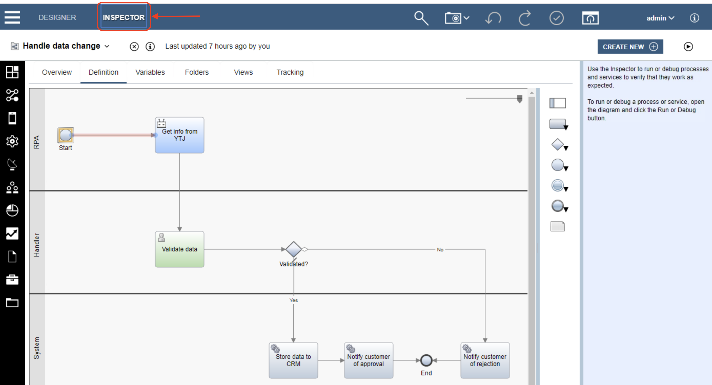
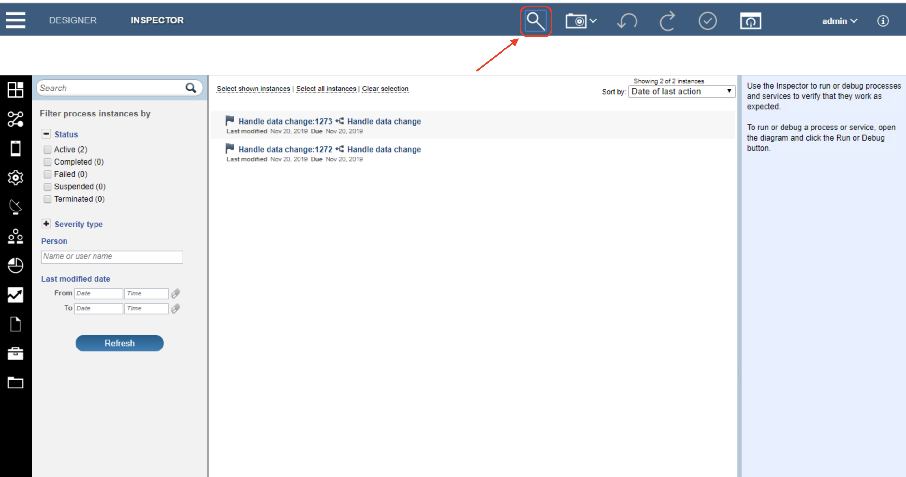
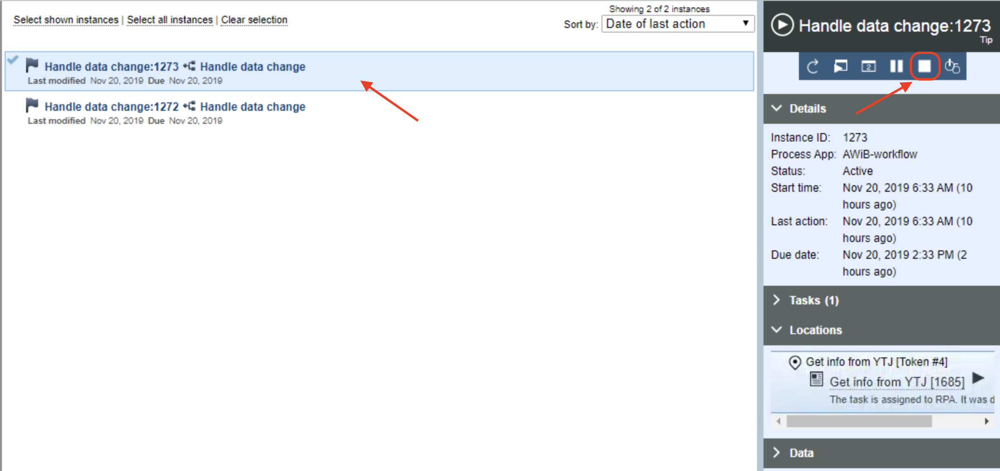
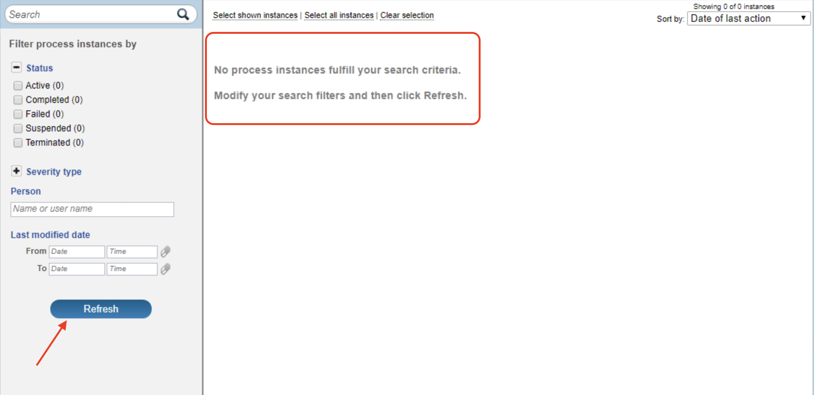
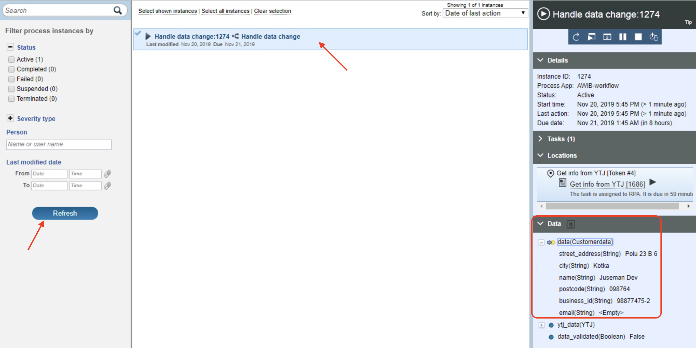

## ALL DONE?

Not quite! Now it's time to test all the components together! Btw, **CONGRATS** making this far!

Now it's time to pull all the things together and test our solution end-to-end. Before running the solution, we need to test that the connection from your IBM Cloud Functions to BAW virtual environment is working and you your Virtual Assistant configurations are correct.

## Test your IBM Cloud Functions connection to BAW

**1.** Open your IBM Cloud Functions view from your IBM Cloud account. Navigate to **_actions_**, open **Get Workflow Token** and in the code view, click the **Invoke** button from the right upper corner.

**2.** If everything is working as expected, you should see a successful activation. **Note!** When you run your action for the first time, it might take serveral seconds (even over 10 secs) to complete. So, be patient.

If you do not see a message about successful activation / you see an error massage, something is wrong and you need to troubleshoot. Otherwise you can move forward to next step.

> Troubleshooting

Check these first:

- Your virtual BAW environment is running (you can access the environment as you did in lab 3 and 4).
- The **port number** you are using in your IBM Cloud Functions _action_ matches with the one you got from your instructor (Lab 2, Setup IBM Cloud Functions: **Step 4**).
- The **code** for your action is exactly as in the instructions (Lab 2, Setup IBM Cloud Functions: **Step 3**).

When you have made the checks and found nothing to correct or after corrections you are still not able to run a successful invocation, please ask help from your instructor.

## Open your BAW web designer INSPECTOR view and make sure you do not have any previous workflow instances running

In order to verify that your Watson Assistant can indeed start a new _**Handle data change**_ workflow instance, you need to open your BAW web designer and its **INSPECTOR** view.

**1.** Open _Handle data change_ process as you did in lab 3, if not already open.

- Open Chrome browser within your virtual desktop and navigate to **Workflow Center - Solutions**.
- Open **Process Apps** and then **AWiB-workflow**.
- Finally open **Handle data change** from the left-hand side navigation bar under _Processes_.

**2.** Switch to _**INSPECTOR**_ view by clicking the "INSPECTOR" text on the top bar.

**3.** Next open the instance search view by clicking the "magnifying glass" icon on the top bar.

**You should NOT have any instances in your environment as the case is with the picture shown above**. If you have accidentally started the workflow during the earlier labs, you might have have similar situation as shown in the picture. If so, follow the below instructions to remove the instances, otherwise you can move to the next section of this lab. **Leave the INSPECTOR / Search View open**.

> How to remove the instances

1. Click the instance to select it and you see the instance information appearing to right-hand side.

2. Click "the Terminate" (if the instance is active) or/and "the Delete" control (if/when the instance is terminated or completed) to clear out the instance from the list. Accept the termination / deletion when asked.
3. Repeat for all the instances in the search result list.
4. Finally click "the Refesh" button to verify that all the instances are deleted and your search result list is clear. **Leave the INSPECTOR / Search View open**.

## Use your Watson Assistant to trigger the workflow

We can run through our Watson Assistant **dialog** and test, if we can trigger a new workflow instance.

**1.** Open your Watson Assistant service and your B2B Bank Bot _**skill**_ - that we imported in Lab 1 and extended in Lab 2 - from IBM Cloud (if not already open).

**2.** Click "**Try it**" button on the top right-hand side to test your skill and its dialog.

**3.** When "the Try it out" section opens to the right of your browser window, run through the dialog with the following selections / input:

- Select **Address change**
- Type in something (does not really matter what) for the _**company name**_.
- Type in something (does not really matter what) for the _**business id**_.
- Type in something (does not really matter what) for the _**street address**_.
- Type in something (does not really matter what) for the _**postcode**_.
- Type in something (does not really matter what) for the _**city**_.
- Click **Yes** when the dialog shows the collected information and asks if it's correct.
- Click **No thanks** when the dialog asks if you want an email confirmation.

**4.** Move back to your **INSPECTOR view** in your virtual environment and hit the **Refresh** button.

``If you have configured everything correctly, you should now see a new active instance in your search results list!``

**Click** the instance to select it and bring up the instance information panel to the right-hand side of the view. You can then expand the **Data** section and the **data(Customerdata)** object to see the data that your Watson Assistant collected via its dialog and sent to your BAW workflow. Nice!

``If you do not see a new instance appearing in 15 seconds and after hitting the **Refresh** button again (when you trigger the workflow for the fist time it might take some time before the instance appears), then your configuration has some errors and you need to troubleshoot.``

If you DO see the instance, you can remove it from the list by first _terminating_ it from the instance information panel controls and then _deleting_ it (look at the instructions above under "_Open your BAW web designer INSPECTOR view and make sure you do not have any previous workflow instances running: How to remove the instances_"). When done, you can move on to the final test!

> Troubleshooting

- The most obvious reason for your end-to-end solution not working at this stage is that you have an error in your Watson Assistant / IBM Cloud Functions _actions_ configuration.
- Check your **Start Address Change Workflow** IBM Cloud Functions _action_ and make sure that the **port number** you are using in your code matches with the one given by your instructor and the code itself is exactly as in the instructions (Lab 2, Setup IBM Cloud Functions: **Step 5**).
- Check your Watson Assistant _dialog node_ **Email given** for any typos for the web action configuration (Lab 2, Setup Watson Assistant to use IBM Cloud Functions: **Step 4**).
- If you can not find the cause for the error, ask help from your instructor!

## Final test with RPA included

**Now you are really close to finishing the exercise!** What we will do next is to repeat the last step (triggering the workflow with Watson Assistant) with our RPA also running.
